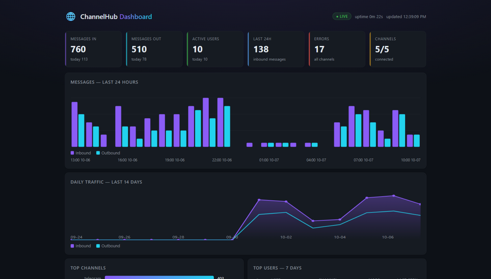

<div align="center">
  
  
</div>

<div align="center">

# 🌐 ChannelHub

*The Universal Multi-Channel Messaging SDK for AI Agents, Autonomous Systems & Microservices*

[](https://www.npmjs.com/package/@theowlops/channelhub)
[](LICENSE)
[](https://bun.sh)
[](#-model-context-protocol-mcp-server)

[English](./README.md) | [Tiếng Việt](./README.vi.md) | [中文](./README.zh.md)

</div>

> **One SDK, every inbox.** ChannelHub unifies Zalo, Telegram, Messenger, TikTok, Discord, Slack, WhatsApp/SMS (Twilio), Email, GitHub and Calendar behind a single, strongly-typed `UnifiedMessage` contract — with a built-in MCP server, a live web dashboard, and zero heavy runtime dependencies. Write your agent's communication logic once; run it everywhere.

---

## 📖 Table of Contents

- [Why ChannelHub?](#-why-channelhub)
- [Channel Capability Matrix](#-channel-capability-matrix)
- [Performance Benchmarks](#-performance-benchmarks)
- [How It Works Deep Dive](#-how-it-works-deep-dive)
- [Installation](#-installation)
- [Quick Start (Zero-Config)](#-quick-start-zero-config)
- [Channel Adapters](#-channel-adapters)
  - [🎵 TikTok for Business](#-tiktok-for-business--shop) · [💬 Messenger](#-meta-messenger-adapter) · [🔵 Zalo](#-zalo-adapter) · [✈️ Telegram](#-telegram-adapter) · [📱 Twilio](#-twilio-adapter) · [🎮 Discord / 💼 Slack](#-discord--slack-adapters)
- [Advanced Engine Features](#-advanced-engine-features)
- [Rich Media, Stickers & GIFs](#-rich-media-stickers--gifs)
- [SmartStreamer for LLMs](#-smartstreamer-for-llms)
- [CLI Toolkit](#-cli-toolkit)
- [Model Context Protocol (MCP) Server](#-model-context-protocol-mcp-server)
- [Live Dashboard](#-live-dashboard)
- [Security Hardening](#-security-hardening)
- [License](#-license)

---

## ✨ Why ChannelHub?

| | Capability | What you get |
| :---: | :--- | :--- |
| 🔌 | **Unified Multi-Platform API** | Write your agent's communication logic once; execute identically across TikTok, Zalo, Telegram, Discord, Messenger and Slack. |
| 🤖 | **AI-Native MCP Daemon** | Built-in Model Context Protocol stdio server exposing **30+ high-level tools** for Claude Desktop, Hermes Agent, OpenClaw and Codex. |
| 🌊 | **SmartStreamer Token Batcher** | Converts LLM token streams into real-time in-place message edits or sentence-boundary chunks — without hitting rate limits. |
| 🧅 | **Onion Middleware Pipeline** | Express/Koa-style `hub.use()` to intercept, modify or short-circuit any message. |
| 🛡 | **Backpressure & Bounded Ingress Queue** | Built-in 2,000-item buffer with async-generator drain waiters to avoid memory leaks during message spikes. |
| 🎬 | **Video Engine & 100MB Uploads** | Native resumable upload of video assets up to 100MB on Meta Messenger, plus an AI-Shorts VideoEngine (FFmpeg / Shotstack). |
| 🐱 | **Native Sticker & GIF Engine** | Send stickers and animated GIFs natively across all supported platforms. |
| 📊 | **Live Web Dashboard** | One-line traffic dashboard — message counts, active users, hourly heatmap — with zero extra dependencies. |
| 🪶 | **Zero Heavy Core** | The engine depends exclusively on the Node.js / Bun standard library (`node:events`, native `fetch`, `node:crypto`). |

---

## 📊 Channel Capability Matrix

| Channel | Outbound Send | Inbound Ingestion | Rich Media & Attachments | Native Reactions | Streaming & Typing | Auth Mode | Current Status |
| :--- | :---: | :---: | :---: | :---: | :---: | :---: | :--- |
| 🔵 **Zalo** | ✅ Full API | ✅ Listener / Polling | ✅ Image, Video, File, Sticker, GIF | ✅ Full Native | ✅ Typing & Sentence Stream | Session Cookie / OA Token | **Stable Inbound/Outbound** |
| ✈️ **Telegram** | ✅ Bot API | ✅ Polling & Webhook | ✅ Photo, Video, File, Sticker, GIF | ✅ Full Native | ✅ In-place Edit Stream | Bot Token | **Stable Inbound/Outbound** |
| 🎵 **TikTok** | ✅ Business API v1.3 | ✅ HMAC Webhook (`message.receive`) | ✅ Images (via `media_id`) | ❌ N/A | ❌ N/A | OAuth2 Access-Token | **Stable Webhook Inbound/Outbound** |
| 💬 **Messenger**| ✅ Graph API v19.0 | ⚡ Webhook Normalizer | ✅ Image, Video (100MB), File, Sticker | ⏳ Planned | ⚡ Typing Indicator | Page Token & Secret | **Stable Outbound + Normalizer** |
| 🎮 **Discord** | ✅ Bot REST API | ⚡ Webhook Normalizer | ✅ Embeds & Attachments | ✅ Full Native | ⚡ In-place Edit Stream | Bot Token | **Stable Outbound + Normalizer** |
| 💼 **Slack** | ✅ Web API / Chat | ⚡ Events Normalizer | ✅ Files & Blocks | ⏳ Planned | ⚡ Typing Indicator | Bot Token | **Stable Outbound + Normalizer** |
| 📱 **Twilio** | ✅ WhatsApp / SMS / MMS | ✅ HMAC Webhook | ✅ Media via URL | ❌ N/A | ❌ N/A | Account SID & Auth Token | **Stable Inbound/Outbound** |

---

## ⚡ Performance Benchmarks

Measured on standard development hardware (Bun v1.4.2 / Node v26.3 runtime, x64 Windows 11). Run `bun run bench` to reproduce locally:

| Subsystem | Metric | Measured Result | Latency / Overhead |
| :--- | :--- | :---: | :---: |
| **Idempotency Cache** | Sliding-window deduplication | **3,500,000+ ops/sec** | ~280 ns / op |
| **Token Bucket Limiter** | Egress rate throttle & burst control | **2,300,000+ ops/sec** | ~430 ns / op |
| **Ingress Pipeline** | Dedup + Context Wrap + Backpressure Queue | **640,000+ msgs/sec** | ~1.5 µs / message |
| **SmartStreamer** | LLM sentence boundary batching & typing pulse | **Instant (< 2ms)** | Sub-millisecond |

```bash
# Execute the benchmark suite
bun run bench
```

---

## 🔬 How It Works Deep Dive

```
                              ┌──────────────────────────────────────────┐
                              │            Your Application /            │
                              │           AI Agent Framework             │
                              └────────────────────┬─────────────────────┘
                                                   │
                                                   ▼
                              ┌──────────────────────────────────────────┐
                              │                ChannelHub                │
                              │          (Core Event Engine)             │
                              └─────────┬──────────┬──────────┬──────────┘
                                        │          │          │
                     ┌──────────────────┴──┐       │       ┌──┴──────────────────┐
                     ▼                     ▼       ▼       ▼                     ▼
             ┌───────────────┐     ┌───────────────┐   ┌───────────────┐ ┌───────────────┐
             │ TikTok        │     │ Messenger     │   │ Zalo          │ │ Telegram /    │
             │ Business      │     │ Adapter       │   │ Adapter       │ │ Discord/Slack │
             └───────┬───────┘     └───────┬───────┘   └───────┬───────┘ └───────┬───────┘
                     │                     │                   │                 │
                     ▼                     ▼                   ▼                 ▼
             TikTok Business       Meta Graph API      zca-js Web API      Bot Gateways &
             Messaging API         Resumable Upload    & OA v3 API         REST Webhooks
```

### 1. Unified Message Protocol (`UnifiedMessage`)
Every incoming payload — regardless of originating protocol (TikTok Webhook, Telegram Polling, Discord WebSocket, Meta Graph API) — is normalized into an immutable, cross-platform standard representation:

```typescript
export interface UnifiedMessage {
  id: string;               // Normalized message identifier
  channel: ChannelType;     // "tiktok" | "zalo" | "telegram" | "discord" | "slack" | "messenger"
  sender: {
    id: string;
    name?: string;
    username?: string;
    avatarUrl?: string;
    isBot?: boolean;
  };
  chat: {
    id: string;
    type: "dm" | "group" | "channel";
    title?: string;
  };
  content: {
    text: string;
    attachments?: MediaAttachment[];
    replyToId?: string;
  };
  raw: unknown;             // Original vendor payload preserved for platform-specific access
  timestamp: number;
}
```

### 2. The MessageContext Lifecycle
When an event occurs, ChannelHub constructs a `MessageContext` wrapper around the event. This decouples message reply logic from the underlying protocol:
- Calling `await ctx.reply("Hello")` automatically resolves the originating channel, routes through the target adapter, manages rate-limiting queues, and emits typing indicators.
- Calling `await ctx.sendMedia({ type: "image", source: "./image.png" })` validates local paths against directory traversal, detects MIME headers, and handles chunked file uploading seamlessly.

---

## 📦 Installation

```bash
# Bun (Recommended)
bun add @theowlops/channelhub

# NPM
npm install @theowlops/channelhub

# PNPM
pnpm add @theowlops/channelhub

# Yarn
yarn add @theowlops/channelhub
```

---

## 🚀 Quick Start (Zero-Config)

Get started in 3 simple steps. ChannelHub handles all the boilerplate for you!

### Step 1: Scaffold your project
Run the interactive init command in an empty folder:
```bash
mkdir my-bot && cd my-bot
npx @theowlops/channelhub init
```
*(This automatically creates `.env`, `bot.ts`, and `package.json` for you).*

### Step 2: Add your tokens
Open the newly created `.env` file and paste your bot tokens (e.g., from [@BotFather](https://t.me/BotFather) for Telegram).

### Step 3: Run your Bot & Diagnose
Install dependencies and start the bot:
```bash
bun install  # or npm install
bun bot.ts   # or npx tsx bot.ts
```

**Not working?** ChannelHub comes with a built-in doctor to check your environment and tokens. Run:
```bash
npx @theowlops/channelhub doctor
```

Or skip scaffolding entirely and wire a bot + live dashboard by hand:

```typescript
import { ChannelHub, TelegramChannelAdapter } from "@theowlops/channelhub";

const hub = new ChannelHub();
hub.register(new TelegramChannelAdapter({ botToken: process.env.TELEGRAM_BOT_TOKEN }));

hub.onMessage(async (ctx) => {
  await ctx.reply(`Echo: ${ctx.message.content.text}`);
});

await hub.dashboard(); // 📊 live dashboard → http://127.0.0.1:8790
await hub.startAll();
```

---

## 🔌 Channel Adapters

### 🎵 TikTok for Business & Shop
Supports TikTok Business Messaging API v1.3. Handles inbound webhooks with timing-safe HMAC-SHA256 signature verification and replay prevention.

```typescript
import { TikTokBusinessAdapter } from "@theowlops/channelhub/tiktok";

const tiktok = new TikTokBusinessAdapter({
  appId: "YOUR_TIKTOK_APP_ID",
  clientSecret: "YOUR_TIKTOK_CLIENT_SECRET",
  accessToken: "YOUR_TIKTOK_ACCESS_TOKEN",
  maxWebhookAgeSeconds: 300 // Replay attack protection (default 300s)
});

// In your HTTP server (Fastify, Express, Bun.serve)
app.post("/webhook/tiktok", async (req, res) => {
  const verified = await tiktok.handleWebhook(req.rawBody, req.headers["tiktok-signature"]);
  if (!verified) return res.status(401).send("Unauthorized");
  return res.status(200).send("OK");
});
```

### 💬 Meta Messenger Adapter
ChannelHub provides two native Messenger integrations:

**1. Meta Graph API (Official Page Bot)**
Supports webhook challenge verification, permissions discovery, and large file support.
```typescript
import { MessengerChannelAdapter } from "@theowlops/channelhub/messenger";

const messenger = new MessengerChannelAdapter({
  pageAccessToken: "EAA...",
  verifyToken: "custom_webhook_secret",
  appSecret: "facebook_app_secret",
  autoSubscribePage: true, // Automatically subscribe to webhook events
});
```

**2. Personal Profile Adapter (Playwright Stealth)**
Automates your personal Facebook account. Uses a persistent browser context to emulate human behavior and bypass Meta security checkpoints.
```typescript
import { MessengerPersonalAdapter } from "@theowlops/channelhub/messenger";

// Run 'channelhub login:messenger' first to generate cookies!
const personal = new MessengerPersonalAdapter({
  headless: true,
  maxMessagesPerMinute: 15,
  humanTypingDelayMs: 40,
});
```

### 🔵 Zalo Adapter
Supports reverse-engineered Web API (`zca-js`) personal sessions and Official Account (OA) v3 OpenAPI. Includes anti-ban jitter algorithms and automatic quote object generation.

```typescript
import { ZaloChannelAdapter } from "@theowlops/channelhub/zalo";

const zalo = new ZaloChannelAdapter({
  credentialsPath: "./credentials.json", // Auto-captured session
  minDelayMs: 300,
  maxDelayMs: 800
});
```

### ✈️ Telegram Adapter
Lightweight bot integration via Telegram Bot API with native webhook and polling dispatchers.

```typescript
import { TelegramChannelAdapter } from "@theowlops/channelhub/telegram";

const telegram = new TelegramChannelAdapter({
  botToken: "123456:ABC-DEF..."
});
```

### 📱 Twilio Adapter
Omnichannel adapter for WhatsApp, SMS, MMS, and RCS via Twilio API. Supports timing-safe HMAC-SHA1 signature verification for webhooks.

```typescript
import { TwilioChannelAdapter } from "@theowlops/channelhub/twilio";

const twilio = new TwilioChannelAdapter({
  accountSid: "AC...",
  authToken: "YOUR_TWILIO_AUTH_TOKEN",
  phoneNumber: "whatsapp:+14155238886" // Or standard SMS number
});
```

### 🎮 Discord & 💼 Slack Adapters
```typescript
import { DiscordChannelAdapter } from "@theowlops/channelhub/discord";
import { SlackChannelAdapter } from "@theowlops/channelhub/slack";

const discord = new DiscordChannelAdapter({ botToken: "DISCORD_TOKEN" });
const slack = new SlackChannelAdapter({ botToken: "xoxb-...", signingSecret: "..." });
```

---

## ⚡ Advanced Engine Features

### 1. Onion Middleware Pipeline (`hub.use`)
Express / Koa-style middleware pipeline allows intercepting, modifying, or short-circuiting message dispatching:

```typescript
// Rate limiting or authentication middleware
hub.use(async (ctx, next) => {
  if (ctx.message.content.text.includes("DROP_ME")) {
    return; // Short-circuit, halts pipeline
  }
  await next(); // Proceed to downstream handlers
});
```

### 2. Human Handoff & Takeover (`ctx.handoff`)
Temporarily mute automated bot responses in a specific chat when human customer support steps in:

```typescript
hub.on("message", async (ctx) => {
  if (ctx.message.content.text === "talk to human") {
    // Pause bot in this chat for 30 minutes
    ctx.handoff(30 * 60 * 1000, "Human agent takeover");
    await ctx.reply("Connecting you to a human agent. Bot muted for 30 minutes.");
    return;
  }
});

// Resume bot manually:
// ctx.resume() or hub.handoff.resume(channel, chatId);
```

### 3. Lock-free Multi-Core Rate Limiter (`SharedTokenBucketLimiter`)
Synchronize rate limits across multiple Node/Bun Worker Threads using `SharedArrayBuffer` and CPU `Atomics`:
- **Throughput:** ~3,700,000 ops/second (nano-second memory latency).
- **Zero Redis Dependency:** Pure in-memory zero-cost synchronization on a single machine.

```typescript
import { SharedTokenBucketLimiter } from "@theowlops/channelhub/core";

const limiter = new SharedTokenBucketLimiter(100, 20); // 100 capacity, 20 refills/sec
if (limiter.tryAcquire(1)) {
  // Dispatched safely within provider quota
}
```

---

## 🎨 Rich Media, Stickers & GIFs

ChannelHub normalizes rich media transmission across all platforms:

```typescript
// 1. Send Images / Files via URL or Local Path
await ctx.sendMedia({
  type: "image",
  source: "https://example.com/art.png",
  caption: "Concept Art"
});

// 2. Send Large Videos (Meta Resumable Upload up to 100MB)
await ctx.sendMedia({
  type: "video",
  source: "/var/media/demo_video.mp4"
});

// 3. Send Native Stickers
// Supports Telegram file_id, Zalo sticker ID, or Messenger sticker ID
await ctx.sendSticker("369239263222822");

// 4. Send Animated GIFs
await ctx.sendGif("https://media.giphy.com/media/cat.gif", "Cat Dancing");
```

---

## 🌊 SmartStreamer for LLMs

LLMs generate responses token by token. Direct API calls per token hit rate limits. `SmartStreamer` batches tokens adaptively:
- **Editable Channels** (Discord, Telegram): Streams first chunk, then edits the message at throttled intervals (`updateIntervalMs: 800`).
- **Non-Editable Channels** (Zalo, Messenger, TikTok): Accumulates tokens and flushes them chunk by chunk on sentence boundaries (`.`, `!`, `?`, `\n`) while emitting typing signals.

```typescript
import { SmartStreamer } from "@theowlops/channelhub/core";

const streamer = new SmartStreamer(ctx, {
  chunkSentences: true,
  updateIntervalMs: 800
});

// Pipe tokens directly from OpenAI / Anthropic / Local LLM
for await (const chunk of llmTokenStream) {
  await streamer.write(chunk);
}
await streamer.end();
```

---

## 🛠️ CLI Toolkit

ChannelHub includes a built-in CLI (`channelhub`) to streamline project scaffolding, account authentication, and environment troubleshooting:

| Command | Purpose | When & How to Use |
| :--- | :--- | :--- |
| `npx @theowlops/channelhub init` | **Project Scaffolder** | Run in an empty folder to auto-generate `.env`, `bot.ts`, and `package.json`. |
| `npx @theowlops/channelhub doctor` | **Environment Diagnostics** | Check missing tokens, inspect Node/Bun runtimes, and verify credential files. |
| `npx @theowlops/channelhub login:zalo` | **Zalo Personal Login** | Generates a terminal QR code. Scan with your phone to extract `credentials.json`. |
| `npx @theowlops/channelhub login:messenger` | **Messenger Personal Login** | Opens a browser window. Log into Facebook to auto-save `messenger.credentials.json`. |
| `npx @theowlops/channelhub start` | **Runtime Runner** | Starts configured ChannelHub services directly from terminal. |
| `npx @theowlops/channelhub version` | **Version Inspector** | Prints current installed version of `@theowlops/channelhub`. |
| `npx @theowlops/channelhub help` | **Command Reference** | Displays list of available CLI commands and usage flags. |

---

## 🤖 Model Context Protocol (MCP) Server

ChannelHub ships with a standalone stdio JSON-RPC MCP server. Connect your AI agent directly to all your chat channels with zero boilerplate.

### Starting the Daemon
```bash
channelhub-mcp
```

### Claude Desktop / Hermes Agent Config
Add to `claude_desktop_config.json`:
```json
{
  "mcpServers": {
    "channelhub": {
      "command": "bun",
      "args": ["run", "channelhub-mcp"]
    }
  }
}
```

### Available MCP Tools (30+)

| Group | Tools |
| :--- | :--- |
| **Messaging** | `channelhub_send_message` · `channelhub_send_media` · `channelhub_send_sticker` · `channelhub_send_gif` · `channelhub_send_typing` · `channelhub_edit_message` · `channelhub_add_reaction` · `channelhub_broadcast` · `channelhub_list_channels` · `channelhub_get_status` |
| **Group Management** | `channelhub_group_create_poll` · `channelhub_group_cast_vote` · `channelhub_group_get_poll_results` · `channelhub_group_check_spam` · `channelhub_group_check_profanity` · `channelhub_group_issue_warning` · `channelhub_group_leaderboard` · `channelhub_group_recap` · `channelhub_group_welcome_challenge` · `channelhub_group_verify_challenge` |
| **Messenger (Personal)** | `channelhub_messenger_get_threads` · `channelhub_messenger_get_history` · `channelhub_messenger_get_members` · `channelhub_messenger_get_user_profile` · `channelhub_messenger_recall_message` |
| **Productivity** | `channelhub_send_email` · `channelhub_github_create_issue` · `channelhub_github_comment` · `channelhub_calendar_quick_add` |
| **Media & Research** | `channelhub_video_create_short` · `channelhub_video_burn_subtitles` · `channelhub_video_add_watermark` · `channelhub_web_search` · `channelhub_web_extract` |

---

## 📊 Live Dashboard

A built-in, zero-dependency web dashboard for your bot traffic — no database, no external service, **one line of code**:

```typescript
await hub.dashboard(); // 📊 → http://127.0.0.1:8790 — that's it
```

<div align="center">
  
</div>

| Widget | What it shows |
| :--- | :--- |
| **Counters** | Inbound / outbound totals, today's traffic, active users, errors, connected channels |
| **24h Bar Chart** | Hourly inbound vs outbound messages |
| **14-Day Trend** | Daily traffic with hover tooltips |
| **Activity Heatmap** | 7 days × 24 hours inbound intensity |
| **Top Channels / Users** | Ranked tables with last-seen timestamps |

The page auto-refreshes every 5 seconds; `GET /api/stats` returns the same JSON snapshot for your own tooling. Non-default port, auth and persistence are optional flags on the same call:

```typescript
await hub.dashboard({
  port: 3000,                          // default 8790, binds 127.0.0.1
  // host: "0.0.0.0",                  // expose beyond localhost — requires apiKey
  apiKey: process.env.DASHBOARD_KEY,   // or CHANNELHUB_DASHBOARD_KEY env
  dataFile: "./channelhub-stats.json", // persist stats across restarts
});
```

Prefer explicit control? `new DashboardBridge(hub, options)` + `await start()` is exactly equivalent.

**Security model**: the HTML page is static and public; all data flows through `GET /api/stats`. On the default loopback binding no key is needed. When `host` is set beyond loopback without an `apiKey`, the API fails closed (401 for every request). With `apiKey` (or the `CHANNELHUB_DASHBOARD_KEY` env), a timing-safe Bearer check protects the endpoint — the page prompts for the key and keeps it in `sessionStorage`.

---

## 🛡 Security Hardening

- **HMAC-SHA256 & Timing-Safe Verification**: All inbound webhooks (TikTok, Messenger, Slack) verify cryptographic signatures via `crypto.timingSafeEqual` to thwart timing attacks.
- **Anti-Replay Attack Protection**: Webhook deliveries outside the allowed time window (default 300s) are immediately discarded.
- **Zero Token Leak in URLs**: Authentication tokens are strictly transmitted in HTTP headers (`Access-Token`, `Authorization: Bearer`), never in URL query strings.
- **Localhost Loopback Default**: Webhook bridge and dashboard default to `127.0.0.1` rather than `0.0.0.0`.
- **DoS Payload Limits**: Enforces a strict 1MB JSON body size ceiling before socket termination.
- **Path Traversal Guard**: All file uploads run through `path.resolve` and verify `fs.statSync().isFile()`, preventing arbitrary file disclosure.
- **Credential Hygiene**: Auto-masks sensitive tokens in logs (`[REDACTED]`) and enforces `.gitignore` rules against credential files.

---

## 📄 License

ChannelHub is licensed under the [MIT License](LICENSE). Maintained by [TheOwlOps Team](https://github.com/TheOwlOps).
