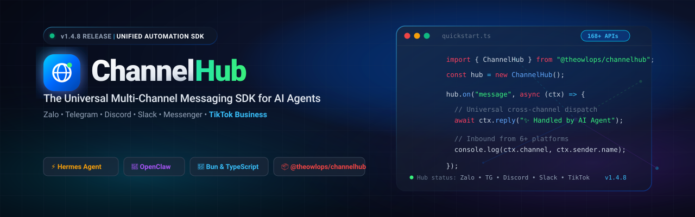

<div align="center">



<br/>
<br/>

[](https://www.npmjs.com/package/@theowlops/zalohub)
[](LICENSE)
[](https://bun.sh)
[](https://github.com/NousResearch/hermes-agent)
[](https://github.com/TheOwlOps)

*Unified reverse-engineered personal web protocol (157 methods via `zca-js`) and official OpenAPI v3 for Zalo OA (11 methods). Plug-and-play for AI agents, standalone bots, and enterprise automation.*

[Installation](#installation) • [Quick Start](#quick-start) • [Hermes & OpenClaw](#ai-agent-integrations) • [API Overview](#features--api-overview-168-actions) • [Contributing](#contributing)

</div>

---

## Highlights

- **168+ Unified Operations**: Complete control over direct messages, groups, polls, reactions, friendship relations, media, catalog, and OA templates.
- **AI Agent Native**: First-class drop-in support for **Hermes Agent** plugins and **OpenClaw** toolkits.
- **Multi-Runtime**: Runs on **Bun** (recommended for zero-build TS execution), **Node.js (≥18)**, and **Deno**.
- **Universal Packaging**: Shipped with ESM, CommonJS (`index.cjs`), and full TypeScript definitions (`.d.ts`).
- **Emoji Unicode Auto-Mapping**: Pass regular Unicode emojis (`❤️`, `😂`, `👍`, `💩`) — automatically converted to internal Zalo reactions.
- **Enterprise-grade Structure**: Clean domain-driven separation between `personal` and `oa` modules.

---

## Installation

```bash
# npm
npm install @theowlops/zalohub

# bun (recommended)
bun add @theowlops/zalohub

# pnpm
pnpm add @theowlops/zalohub

# yarn
yarn add @theowlops/zalohub
```

---

## Quick Start

### 1. Authentication (Personal Account)

Generate and scan the QR code to save your session credentials:

```bash
npx @theowlops/zalohub login
```
*This saves authentication cookies, encryption keys, and IMEI to `credentials.json` locally.*

---

### 2. Send Message & Drop Reactions

```ts
import { initPersonalBot } from "@theowlops/zalohub";

const { bot, listenEvents } = await initPersonalBot();

// Listen for incoming messages
listenEvents.on("message", async (msg) => {
  console.log(`[${msg.threadId}] ${msg.senderId}: ${msg.content}`);

  // Auto-react with heart emoji to incoming messages
  await bot.addReaction(msg.threadId, msg.msgId, msg.cliMsgId, "❤️", msg.isGroup);

  // Reply back
  if (msg.content === "!ping") {
    await bot.sendText(msg.threadId, "Pong from ZaloHub! 🏓", [], msg.isGroup);
  }
});
```

---

### 3. Zalo Official Account (OA)

```ts
import { ZaloOABot } from "@theowlops/zalohub";

const oa = new ZaloOABot(process.env.ZALO_OA_ACCESS_TOKEN);

// Send consultant CS message
await oa.sendConsultantText("USER_ID", "Hello from ZaloHub Official Account!");

// Send transactional template message
await oa.sendTransactionMessage("USER_ID", "TEMPLATE_ID", {
  customer_name: "Alex",
  order_code: "#ORD-9821"
});
```

---

## AI Agent Integrations

### Hermes Agent Integration

Drop ZaloHub directly into your custom Hermes Gateway plugin:

```ts
import { initPersonalBot, ZaloPersonalBot } from "@theowlops/zalohub";

export default async function hermesZaloPlugin(hermes) {
  const { bot, listenEvents } = await initPersonalBot();

  // Inbound bridge (Zalo -> Hermes)
  listenEvents.on("message", async (msg) => {
    if (msg.isSelf) return;

    const response = await hermes.prompt({
      user: msg.senderId,
      text: msg.content
    });

    // Outbound response (Hermes -> Zalo)
    await bot.sendText(msg.threadId, response.text, [], msg.isGroup);
  });
}
```

---

### OpenClaw Tool Integration

Expose Zalo capabilities as tools to autonomous agents:

```ts
import { ZaloPersonalBot } from "@theowlops/zalohub";

export const zaloSendTool = {
  name: "zalo_send_message",
  description: "Send text message or drop emoji reaction into a Zalo chat group",
  parameters: {
    type: "object",
    properties: {
      threadId: { type: "string", description: "Target group or user ID" },
      content: { type: "string", description: "Text content to deliver" },
      reaction: { type: "string", description: "Optional emoji reaction, e.g. ❤️, 👍" }
    },
    required: ["threadId", "content"]
  },
  execute: async ({ threadId, content, reaction }, context) => {
    const bot = new ZaloPersonalBot(context.zaloApi);
    const sent = await bot.sendText(threadId, content, [], true);
    if (reaction) {
      await bot.addReaction(threadId, sent.msgId, sent.cliMsgId, reaction);
    }
    return { success: true, messageId: sent.msgId };
  }
};
```

---

## Features & API Overview (168+ Actions)

### A. Personal Account SDK (`ZaloPersonalBot`) — 157 Methods

| Category | Count | Key Methods |
|---|---|---|
| **Messaging & Media** | 14 | `sendText`, `sendImage`, `sendVideo`, `sendVoice`, `sendLink`, `sendCard`, `sendBankCard`, `forwardMessage`, `recallMessage`, `deleteMessage`, `deleteChat`, `parseLink`, `scanURL` |
| **Reactions & Events** | 7 | `addReaction` (Unicode or internal codes), `sendTypingEvent`, `sendSeenEvent`, `sendDeliveredEvent`, `addUnreadMark`, `removeUnreadMark`, `getUnreadMark` |
| **Stickers & Attachments** | 6 | `sendSticker`, `getStickers`, `searchSticker`, `getStickersDetail`, `uploadAttachment` |
| **Group Administration** | 26 | `createGroup`, `disperseGroup`, `leaveGroup`, `changeGroupName`, `changeGroupAvatar`, `changeGroupOwner`, `addGroupDeputy`, `removeGroupDeputy`, `addUserToGroup`, `removeUserFromGroup` (kick), `addGroupBlockedMember`, `updateGroupSettings`, `upgradeGroupToCommunity`, `getGroupLinkInfo`, `joinGroupLink` |
| **Polls & Voting** | 6 | `createPoll`, `votePoll`, `addPollOptions`, `lockPoll`, `sharePoll`, `getPollDetail` |
| **Notes & Reminders** | 10 | `createNote`, `editNote`, `getListBoard`, `createReminder`, `editReminder`, `removeReminder`, `getListReminder`, `getReminderResponses` |
| **Friendship & Relations** | 18 | `getAllFriends`, `getCloseFriends`, `getFriendOnlines`, `sendFriendRequest`, `acceptFriendRequest`, `rejectFriendRequest`, `removeFriend`, `changeFriendAlias`, `blockUser`, `unblockUser` |
| **User Search & Profiles** | 16 | `findUserByPhone`, `findUserByUsername`, `getUserInfo`, `getOwnId`, `fetchAccountInfo`, `updateProfile`, `changeAccountAvatar`, `lastOnline` |
| **Conversation Controls** | 13 | `setMute`, `setPinnedConversations`, `setHiddenConversations`, `updateAutoDeleteChat` (TTL), `updateArchivedChatList` |
| **Quick Replies & Auto-Reply** | 8 | `addQuickMessage`, `updateQuickMessage`, `removeQuickMessage`, `createAutoReply`, `getAutoReplyList` |
| **Catalog & E-commerce** | 10 | `createCatalog`, `updateCatalog`, `createProductCatalog`, `uploadProductPhoto` |
| **Banking** | 5 | `createBankAccount`, `updateBankAccount`, `getListBank`, `getListBankAccount` |
| **Session & Diagnostics** | 12 | `getSettings`, `updateLang`, `getListDevice`, `getQR`, `keepAlive`, `sendReport`, `custom` |

---

### B. Official Account SDK (`ZaloOABot`) — 11 Methods

| Endpoint Group | Methods |
|---|---|
| **Customer Support (CS)** | `sendConsultantText(userId, text)`, `sendConsultantImage(userId, attachmentId)` |
| **Transactions & Promos** | `sendTransactionMessage(userId, templateId, data)`, `sendPromotionMessage(userId, templateId, data)` |
| **Followers & Profiles** | `getProfile(userId)`, `getFollowers(offset, count)` |
| **Customer Tagging** | `getTags()`, `tagUser(userId, tagName)`, `removeTag(userId, tagName)` |
| **Media & Authentication** | `uploadImage(blob)`, `refreshAccessToken(refreshToken)` |

---

## Project Structure

```
zalohub/
├── src/
│   ├── config/             # Environment & defaults
│   │   └── env.ts
│   ├── personal/           # Personal Bot implementation (zca-js)
│   │   ├── client.ts       # 157 unified methods
│   │   └── index.ts
│   ├── oa/                 # Official Account implementation (OpenAPI v3)
│   │   ├── client.ts       # 11 REST methods
│   │   └── index.ts
│   ├── commands/           # Extensible Command Router
│   │   ├── router.ts
│   │   └── modules/        # general.ts, group.ts, reaction.ts
│   └── index.ts            # Public entrypoint
├── dist/                   # Bundled artifacts (ESM, CJS, .d.ts)
├── bin/cli.ts              # Command-line interface executable
├── scripts/
│   ├── login_personal.ts   # Interactive QR generator
│   └── build.ts            # Multi-format SDK builder
├── setup.bat / setup.sh    # One-click native installers
└── package.json
```

---

## Development & Local Build

```bash
# Clone repository
git clone https://github.com/TheOwlOps/ZaloHub.git
cd ZaloHub

# Install dependencies via Bun
bun install

# Start development bot with hot-reloading
bun run dev

# Compile distribution files (ESM, CJS, .d.ts)
bun run build
```

---

## Security & Best Practices

1. **Credentials Isolation**: Never commit `credentials.json` or `.env` to source control. Both are pre-configured in `.gitignore` and `.npmignore`.
2. **Reverse Protocol Disclaimer**: The personal automation layer utilizes reverse-engineered web endpoints (`zca-js`). Use secondary accounts to minimize risk of account restrictions.
3. **Official Account Operations**: For production enterprise messaging, utilize the `ZaloOABot` client with verified OA tokens via [Zalo Developers](https://developers.zalo.me).

---

## License

Distributed under the [MIT License](LICENSE).  
Maintained by [TheOwlOps](https://github.com/TheOwlOps).
