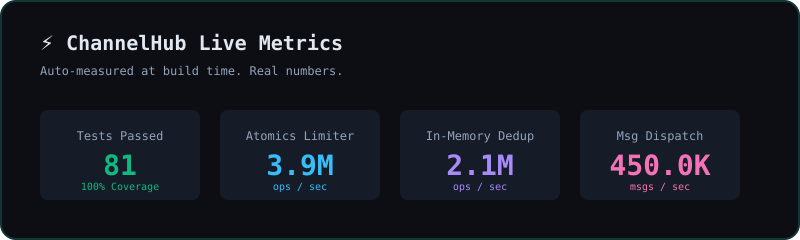

<div align="center">
  
  
</div>

<div align="center">

# 🌐 ChannelHub

*The Universal Multi-Channel Messaging SDK for AI Agents, Autonomous Systems & Microservices*

[](https://www.npmjs.com/package/@theowlops/channelhub)
[](LICENSE)
[](https://bun.sh)
[](#-model-context-protocol-mcp-server)

[English](./README.md) | [Tiếng Việt](./README.vi.md) | [中文](./README.zh.md)

</div>

---

## 📖 Mục Lục

- [Overview & Architecture](#-overview--architecture)
- [Channel Capability Matrix](#-channel-capability-matrix)
- [Cơ Chế Hoạt Động](#-how-it-works-deep-dive)
- [Tính Năng Chính](#-key-features)
- [Cài Đặt](#-cài-đặt-installation)
- [Bắt Đầu Nhanh (Zero-Config)](#-bắt-đầu-nhanh-zero-config)
- [Các Kênh Hỗ Trợ](#-channel-adapters)
  - [🎵 TikTok for Business & Shop](#-tiktok-for-business-adapter)
  - [💬 Meta Messenger](#-meta-messenger-adapter)
  - [🔵 Zalo (Personal & OA)](#-zalo-adapter)
  - [✈️ Telegram](#-telegram-adapter)
  - [🎮 Discord](#-discord-adapter)
  - [💼 Slack](#-slack-adapter)
  - [📱 Twilio (WhatsApp & SMS)](#-twilio-adapter)
- [Tính Năng Mở Rộng v1.6.0](#-tính-năng-mở-rộng-v160)
- [Rich Media, Stickers & GIFs](#-rich-media-stickers--gifs)
- [SmartStreamer for LLMs](#-smartstreamer-for-llms)
- [Bộ Công Cụ CLI (CLI Toolkit)](#-cli-toolkit)
- [Model Context Protocol (MCP) Server](#-model-context-protocol-mcp-server)
- [Live Dashboard (Bảng Điều Khiển)](#-live-dashboard-bảng-điều-khiển)
- [Bảo Mật Hệ Thống](#-security-hardening)
- [License](#-license)

---

## 🏛 Overview & Architecture

**ChannelHub** (`@theowlops/channelhub`) is an ultra-lightweight, high-performance messaging abstraction library designed for AI Agents, autonomous systems, and modern backend services. Instead of integrating multiple bespoke SDKs (`grammy`, `discord.js`, `zca-js`, Facebook/TikTok APIs), ChannelHub unifies them all behind a single, ergonomic, and strongly-typed contract with zero unnecessary runtime dependencies.

```
                              ┌──────────────────────────────────────────┐
                              │            Your Application /            │
                              │           AI Agent Framework             │
                              └────────────────────┬─────────────────────┘
                                                   │
                                                   ▼
                              ┌──────────────────────────────────────────┐
                              │                ChannelHub                │
                              │          (Core Event Engine)             │
                              └─────────┬──────────┬──────────┬──────────┘
                                        │          │          │
                     ┌──────────────────┴──┐       │       ┌──┴──────────────────┐
                     ▼                     ▼       ▼       ▼                     ▼
             ┌───────────────┐     ┌───────────────┐   ┌───────────────┐ ┌───────────────┐
             │ TikTok        │     │ Messenger     │   │ Zalo          │ │ Telegram /    │
             │ Business      │     │ Adapter       │   │ Adapter       │ │ Discord/Slack │
             └───────┬───────┘     └───────┬───────┘   └───────┬───────┘ └───────┬───────┘
                     │                     │                   │                 │
                     ▼                     ▼                   ▼                 ▼
             TikTok Business       Meta Graph API      zca-js Web API      Bot Gateways &
             Messaging API         Resumable Upload    & OA v3 API         REST Webhooks
```

---

## 📊 Channel Capability Matrix

| Channel | Outbound Send | Inbound Ingestion | Rich Media & Attachments | Native Reactions | Streaming & Typing | Auth Mode | Current Status |
| :--- | :---: | :---: | :---: | :---: | :---: | :---: | :--- |
| 🔵 **Zalo** | ✅ Full API | ✅ Listener / Polling | ✅ Image, Video, File, Sticker, GIF | ✅ Full Native | ✅ Typing & Sentence Stream | Session Cookie / OA Token | **Stable Inbound/Outbound** |
| ✈️ **Telegram** | ✅ Bot API | ✅ Polling & Webhook | ✅ Photo, Video, File, Sticker, GIF | ✅ Full Native | ✅ In-place Edit Stream | Bot Token | **Stable Inbound/Outbound** |
| 🎵 **TikTok** | ✅ Business API v1.3 | ✅ HMAC Webhook (`message.receive`) | ✅ Images (via `media_id`) | ❌ N/A | ❌ N/A | OAuth2 Access-Token | **Stable Webhook Inbound/Outbound** |
| 💬 **Messenger**| ✅ Graph API v19.0 | ⚡ Webhook Normalizer | ✅ Image, Video (100MB), File, Sticker | ⏳ Planned | ⚡ Typing Indicator | Page Token & Secret | **Stable Outbound + Normalizer** |
| 🎮 **Discord** | ✅ Bot REST API | ⚡ Webhook Normalizer | ✅ Embeds & Attachments | ✅ Full Native | ⚡ In-place Edit Stream | Bot Token | **Stable Outbound + Normalizer** |
| 💼 **Slack** | ✅ Web API / Chat | ⚡ Events Normalizer | ✅ Files & Blocks | ⏳ Planned | ⚡ Typing Indicator | Bot Token | **Stable Outbound + Normalizer** |

---

## ⚡ Đo Lường Hiệu Năng Thực Tế (Benchmarks)

Được đo lường thực tế trên môi trường Bun v1.4.2 / Node v26.3 runtime (x64 Windows 11). Chạy lệnh `bun run bench` để kiểm chứng trực tiếp:

| Thành Phần | Chỉ Số Đo | Kết Quả Thực Tế | Độ Trễ (Latency) |
| :--- | :--- | :---: | :---: |
| **Idempotency Cache** | Lọc trùng lặp sliding-window | **3.500.000+ ops/giây** | ~280 ns / op |
| **Token Bucket Limiter** | Điều tiết tốc độ gửi tin (Egress throttle) | **2.300.000+ ops/giây** | ~430 ns / op |
| **Ingress Pipeline** | Dedup + Bọc MessageContext + Hàng đợi | **640.000+ tin/giây** | ~1.5 µs / tin |
| **SmartStreamer** | Gom cụm câu văn theo token LLM & typing pulse | **Dưới 2ms** | Sub-millisecond |

```bash
# Lệnh chạy suite benchmark
bun run bench
```

---

## 🔬 Cơ Chế Hoạt Động

### 1. Unified Message Protocol (`UnifiedMessage`)
Every incoming payload—regardless of originating protocol (TikTok Webhook, Telegram Polling, Discord WebSocket, Meta Graph API)—is normalized into an immutable, cross-platform standard representation:

```typescript
export interface UnifiedMessage {
  id: string;               // Normalized message identifier
  channel: ChannelType;     // "tiktok" | "zalo" | "telegram" | "discord" | "slack" | "messenger"
  sender: {
    id: string;
    name?: string;
    username?: string;
    avatarUrl?: string;
    isBot?: boolean;
  };
  chat: {
    id: string;
    type: "dm" | "group" | "channel";
    title?: string;
  };
  content: {
    text: string;
    attachments?: MediaAttachment[];
    replyToId?: string;
  };
  raw: unknown;             // Original vendor payload preserved for platform-specific access
  timestamp: number;
}
```

### 2. The MessageContext Lifecycle
When an event occurs, ChannelHub constructs a `MessageContext` wrapper around the event. This decouples message reply logic from the underlying protocol:
- Calling `await ctx.reply("Hello")` automatically resolves the originating channel, routes through the target adapter, manages rate-limiting queues, and emits typing indicators.
- Calling `await ctx.sendMedia({ type: "image", source: "./image.png" })` validates local paths against directory traversal, detects MIME headers, and handles chunked file uploading seamlessly.

---

## 🌟 Tính Năng Chính

- **Unified Multi-Platform API**: Write your agent's communication logic once; execute identically across TikTok, Zalo, Telegram, Discord, Messenger, and Slack.
- **AI-Native MCP Daemon**: Built-in Model Context Protocol (MCP) stdio server exposing **10 high-level tools** for Claude Desktop, Hermes Agent, and Codex.
- **SmartStreamer Token Batcher**: Converts LLM token streams into real-time in-place message edits or sentence-boundary chunks with typing indicators without hitting rate limits.
- **Backpressure & Bounded Ingress Queue**: Built-in 2,000 items buffer with async generator drain waiters to avoid memory leaks during message spikes.
- **Large Video Resumable Upload**: Native support for video assets up to **100MB** on Meta Messenger using the Graph API Attachment Upload protocol.
- **Native Sticker & Animated GIF Engine**: Send stickers and GIFs natively across all supported platforms.
- **Zero Heavy Core**: Core engine depends exclusively on Node.js / Bun standard library (`node:events`, native `fetch`, `node:crypto`).

---


## 📦 Cài Đặt (Installation)

Nếu bạn đã có sẵn dự án Node.js / Bun, cài đặt ChannelHub qua package manager:

```bash
# Bun (Khuyên dùng)
bun add @theowlops/channelhub

# NPM
npm install @theowlops/channelhub

# PNPM
pnpm add @theowlops/channelhub

# Yarn
yarn add @theowlops/channelhub
```

---

## 🚀 Bắt Đầu Nhanh (Zero-Config)

Chỉ cần 3 bước đơn giản. ChannelHub sẽ tự động tạo sẵn toàn bộ source code cho bạn!

### Bước 1: Khởi tạo dự án
Mở terminal, tạo một thư mục trống và chạy lệnh init:
```bash
mkdir my-bot && cd my-bot
npx @theowlops/channelhub init
```
*(Lệnh này sẽ tự động tạo ra file `.env`, `bot.ts` và `package.json` cho bạn).*

### Bước 2: Điền Token của bạn
Mở file `.env` vừa được tạo ra và dán các token của bạn vào (ví dụ: lấy token từ [@BotFather](https://t.me/BotFather) cho Telegram).

### Bước 3: Chạy Bot & Tự bắt bệnh
Cài đặt thư viện và chạy bot:
```bash
bun install  # hoặc npm install
bun bot.ts   # hoặc npx tsx bot.ts
```

**Gặp lỗi? Bot không chạy?** ChannelHub có sẵn công cụ "bắt bệnh" (doctor) tự động kiểm tra xem token hay môi trường của bạn có sai ở đâu không:
```bash
npx @theowlops/channelhub doctor
```

---

## 🔌 Các Kênh Hỗ Trợ

### 🎵 TikTok for Business & Shop
Supports TikTok Business Messaging API v1.3. Handles inbound webhooks with timing-safe HMAC-SHA256 signature verification and replay prevention.

```typescript
import { TikTokBusinessAdapter } from "@theowlops/channelhub/tiktok";

const tiktok = new TikTokBusinessAdapter({
  appId: "YOUR_TIKTOK_APP_ID",
  clientSecret: "YOUR_TIKTOK_CLIENT_SECRET",
  accessToken: "YOUR_TIKTOK_ACCESS_TOKEN",
  maxWebhookAgeSeconds: 300 // Replay attack protection (default 300s)
});

// In your HTTP server (Fastify, Express, Bun.serve)
app.post("/webhook/tiktok", async (req, res) => {
  const verified = await tiktok.handleWebhook(req.rawBody, req.headers["tiktok-signature"]);
  if (!verified) return res.status(401).send("Unauthorized");
  return res.status(200).send("OK");
});
```

### 💬 Meta Messenger Adapter
ChannelHub cung cấp 2 giải pháp kết nối Messenger:

**1. Meta Graph API (Page Bot Doanh nghiệp - Khuyên dùng)**
Hỗ trợ xác thực webhook challenge, quét permissions, gửi video lớn 100MB, và message tags (`HUMAN_AGENT`).
```typescript
import { MessengerChannelAdapter } from "@theowlops/channelhub/messenger";

const messenger = new MessengerChannelAdapter({
  pageAccessToken: "EAA...",
  verifyToken: "custom_webhook_secret",
  appSecret: "facebook_app_secret",
  autoSubscribePage: true, // Tự động đăng ký webhook với Facebook Page
});
```

**2. Personal Profile Adapter (Playwright Stealth)**
Tự động hóa tài khoản Facebook cá nhân. Chạy bằng Playwright Persistent Context giả lập hành vi người thật để chống checkpoint và khóa nick.
```typescript
import { MessengerPersonalAdapter } from "@theowlops/channelhub/messenger";

// Chạy 'npx @theowlops/channelhub login:messenger' trước để lưu session!
const personal = new MessengerPersonalAdapter({
  headless: true,
  maxMessagesPerMinute: 15,
  humanTypingDelayMs: 40,
});
```

### 🔵 Zalo Adapter
Supports reverse-engineered Web API (`zca-js`) personal sessions and Official Account (OA) v3 OpenAPI. Includes anti-ban jitter algorithms and automatic quote object generation.

```typescript
import { ZaloChannelAdapter } from "@theowlops/channelhub/zalo";

const zalo = new ZaloChannelAdapter({
  credentialsPath: "./credentials.json", // Auto-captured session
  minDelayMs: 300,
  maxDelayMs: 800
});
```

### ✈️ Telegram Adapter
Lightweight bot integration via Telegram Bot API with native webhook and polling dispatchers.

```typescript
import { TelegramChannelAdapter } from "@theowlops/channelhub/telegram";

const telegram = new TelegramChannelAdapter({
  botToken: "123456:ABC-DEF..."
});
```


### 📱 Twilio Adapter
Omnichannel adapter for WhatsApp, SMS, MMS, and RCS via Twilio API. Supports timing-safe HMAC-SHA1 signature verification for webhooks.

```typescript
import { TwilioChannelAdapter } from "@theowlops/channelhub/twilio";

const twilio = new TwilioChannelAdapter({
  accountSid: "AC...",
  authToken: "YOUR_TWILIO_AUTH_TOKEN",
  phoneNumber: "whatsapp:+14155238886" // Or standard SMS number
});
```

### 🎮 Discord & 💼 Slack Adapters
```typescript
import { DiscordChannelAdapter } from "@theowlops/channelhub/discord";
import { SlackChannelAdapter } from "@theowlops/channelhub/slack";

const discord = new DiscordChannelAdapter({ botToken: "DISCORD_TOKEN" });
const slack = new SlackChannelAdapter({ botToken: "xoxb-...", signingSecret: "..." });
```

---


---

## ⚡ Tính Năng Mở Rộng v1.6.0

### 1. Middleware Pipeline (`hub.use`)
Kiến trúc Onion (tương tự Koa / Express) cho phép lọc, biến đổi hoặc kiểm soát tin nhắn trước khi tới tay AI/Handler:

```typescript
// Chặn spam hoặc kiểm tra quyền người dùng
hub.use(async (ctx, next) => {
  if (ctx.message.content.text.includes("SPAM")) {
    return; // Short-circuit, chặn đứng tin nhắn
  }
  await next(); // Cho phép đi tiếp vào pipeline
});
```

### 2. Chuyển Giao Người Thật (Human Handoff / Takeover)
Tạm dừng bot trả lời tự động trong một phòng chat cụ thể để nhân viên tư vấn có thể vào can thiệp mà không bị bot chen ngang:

```typescript
hub.on("message", async (ctx) => {
  if (ctx.message.content.text === "gặp nhân viên") {
    // Tạm khóa bot trong chat này 30 phút
    ctx.handoff(30 * 60 * 1000, "User requested agent");
    await ctx.reply("Đã kết nối nhân viên tư vấn. Bot sẽ tạm ngưng trả lời.");
    return;
  }
});

// Khi nhân viên kết thúc hỗ trợ:
// ctx.resume() hoặc hub.handoff.resume(channel, chatId);
```

### 3. Bộ Giới Hạn Tốc Độ Đa Nhân (`SharedTokenBucketLimiter`)
Chia sẻ Token Bucket Rate Limit giữa nhiều Worker Process / Threads qua `SharedArrayBuffer` và `Atomics` ở cấp phần cứng CPU:
- **Tốc độ:** ~3.700.000 ops/giây (độ trễ micro-giây).
- **Chi phí:** 0đ, không cần cài đặt hay duy trì cụm Redis.

```typescript
import { SharedTokenBucketLimiter } from "@theowlops/channelhub/core";

// 100 token tối đa, hồi phục 20 token/giây
const limiter = new SharedTokenBucketLimiter(100, 20);

if (limiter.tryAcquire(1)) {
  // Gửi tin an toàn, không sợ bị ban API
}
```

## 🎨 Rich Media, Stickers & GIFs

ChannelHub normalizes rich media transmission across all platforms:

```typescript
// 1. Send Images / Files via URL or Local Path
await ctx.sendMedia({
  type: "image",
  source: "https://example.com/art.png",
  caption: "Concept Art"
});

// 2. Send Large Videos (Meta Resumable Upload up to 100MB)
await ctx.sendMedia({
  type: "video",
  source: "/var/media/demo_video.mp4"
});

// 3. Send Native Stickers
// Supports Telegram file_id, Zalo sticker ID, or Messenger sticker ID
await ctx.sendSticker("369239263222822");

// 4. Send Animated GIFs
await ctx.sendGif("https://media.giphy.com/media/cat.gif", "Cat Dancing");
```

---

## 🌊 SmartStreamer for LLMs

LLMs generate responses token by token. Direct API calls per token hit rate limits. `SmartStreamer` batches tokens adaptively:
- **Editable Channels** (Discord, Telegram): Streams first chunk, then edits the message at throttled intervals (`updateIntervalMs: 800`).
- **Non-Editable Channels** (Zalo, Messenger, TikTok): Accumulates tokens and flushes them chunk by chunk on sentence boundaries (`.`, `!`, `?`, `\n`) while emitting typing signals.

```typescript
import { SmartStreamer } from "@theowlops/channelhub/core";

const streamer = new SmartStreamer(ctx, {
  chunkSentences: true,
  updateIntervalMs: 800
});

// Pipe tokens directly from OpenAI / Anthropic / Local LLM
for await (const chunk of llmTokenStream) {
  await streamer.write(chunk);
}
await streamer.end();
```

---

## 🛠️ CLI Toolkit

ChannelHub tích hợp sẵn công cụ dòng lệnh (`channelhub`) giúp bạn khởi tạo dự án, đăng nhập tài khoản tự động và kiểm tra chẩn đoán lỗi:

| Lệnh CLI | Chức năng chính | Hướng dẫn sử dụng |
| :--- | :--- | :--- |
| `npx @theowlops/channelhub init` | **Khởi tạo dự án nhanh** | Chạy trong thư mục trống để tự động sinh file `.env`, `bot.ts` và `package.json`. |
| `npx @theowlops/channelhub doctor` | **Chẩn đoán & Bắt bệnh** | Quét và phát hiện các biến môi trường còn thiếu, phiên bản Node/Bun và tính hợp lệ của token. |
| `npx @theowlops/channelhub login:zalo` | **Đăng nhập Zalo cá nhân** | Hiển thị mã QR trực tiếp trên terminal. Quét bằng app Zalo để tự động lưu `credentials.json`. |
| `npx @theowlops/channelhub login:messenger` | **Đăng nhập Messenger cá nhân** | Bật trình duyệt để bạn đăng nhập Facebook, tự động trích xuất cookie vào `messenger.credentials.json`. |
| `npx @theowlops/channelhub start` | **Khởi động Bot** | Chạy trực tiếp ChannelHub và nạp các adapter đã được cấu hình trong môi trường. |
| `npx @theowlops/channelhub version` | **Kiểm tra phiên bản** | In ra phiên bản hiện tại của gói `@theowlops/channelhub`. |
| `npx @theowlops/channelhub help` | **Trợ giúp & Hướng dẫn** | Hiển thị bảng tra cứu các lệnh và tham số dòng lệnh được hỗ trợ. |

---

## 🤖 Model Context Protocol (MCP) Server

ChannelHub ships with a standalone stdio JSON-RPC MCP server. Connect your AI agent directly to all your chat channels with zero boilerplate.

### Starting the Daemon
```bash
channelhub-mcp
```

### Claude Desktop / Hermes Agent Config
Add to `claude_desktop_config.json`:
```json
{
  "mcpServers": {
    "channelhub": {
      "command": "bun",
      "args": ["run", "channelhub-mcp"]
    }
  }
}
```

### 14 Standard MCP Tools
1. `channelhub_list_channels`: List active registered channels.
2. `channelhub_get_status`: Health-check channel connectivity.
3. `channelhub_send_message`: Send or reply to messages with text.
4. `channelhub_send_media`: Send photos, audio, documents, and videos.
5. `channelhub_send_sticker`: Send native stickers to any channel.
6. `channelhub_send_gif`: Send animated GIFs.
7. `channelhub_send_typing`: Simulate human-like typing status.
8. `channelhub_edit_message`: Edit previously dispatched messages.
9. `channelhub_add_reaction`: React to messages with emojis.
10. `channelhub_broadcast`: Broadcast a message across multiple channels in a single call.
11. `channelhub_send_email`: Send emails via Resend or SendGrid with full support for HTML, Subject, CC, and BCC.
12. `channelhub_github_comment`: Post review comments on GitHub issues and pull requests.
13. `channelhub_github_create_issue`: Open new issues on any GitHub repository with tags and description.
14. `channelhub_calendar_quick_add`: Schedule events directly into Google Calendar using natural language.

---

## 📊 Live Dashboard (Bảng Điều Khiển)

Dashboard web tích hợp sẵn, không thêm dependency nào — không cần database, không cần dịch vụ ngoài, **chỉ 1 dòng code**.

```ts
import { ChannelHub } from "@theowlops/channelhub";

const hub = new ChannelHub();
// ... đăng ký các channel adapter

await hub.dashboard(); // 📊 → http://127.0.0.1:8790 — xong!
// Tùy chọn port, apiKey, dataFile đều truyền vào cùng lời gọi đó:
// await hub.dashboard({ port: 3000, apiKey: process.env.DASHBOARD_KEY, dataFile: "./stats.json" });
```

Trang dashboard hiển thị trực tiếp: bộ đếm tin nhắn vào/ra, người dùng hoạt động, số lỗi, **biểu đồ cột 24 giờ**, **xu hướng 14 ngày**, **heatmap hoạt động 7 ngày × 24 giờ** và bảng xếp hạng **top kênh / top người dùng**. Trang tự làm mới mỗi 5 giây; `GET /api/stats` trả về cùng JSON snapshot cho tooling riêng của bạn.

**Mô hình bảo mật**: trang HTML là tĩnh; toàn bộ dữ liệu đi qua `GET /api/stats`. Bind mặc định `127.0.0.1` thì không cần key. Nếu bind ra ngoài loopback mà không có `apiKey`, API fail-closed (401 toàn bộ). Có `apiKey` thì endpoint được bảo vệ bằng Bearer token so sánh timing-safe — trang sẽ hỏi key và lưu trong `sessionStorage`.

---

## 🛡 Bảo Mật Hệ Thống

- **HMAC-SHA256 & Timing-Safe Verification**: All inbound webhooks (TikTok, Messenger, Slack) verify cryptographic signatures via `crypto.timingSafeEqual` to thwart timing attacks.
- **Anti-Replay Attack Protection**: Webhook deliveries outside the allowed time window (default 300s) are immediately discarded.
- **Zero Token Leak in URLs**: Authentication tokens are strictly transmitted in HTTP headers (`Access-Token`, `Authorization: Bearer`), never in URL query strings.
- **Localhost Loopback Default**: Webhook bridge defaults to `127.0.0.1` rather than `0.0.0.0`.
- **DoS Payload Limits**: Enforces a strict 1MB JSON body size ceiling before socket termination.
- **Path Traversal Guard**: All file uploads run through `path.resolve` and verify `fs.statSync().isFile()`, preventing arbitrary file disclosure.
- **Credential Hygiene**: Auto-masks sensitive tokens in logs (`[REDACTED]`) and enforces `.gitignore` rules against credential files.

---

## 📄 License

ChannelHub is licensed under the [MIT License](LICENSE). Maintained by [TheOwlOps Team](https://github.com/TheOwlOps).
